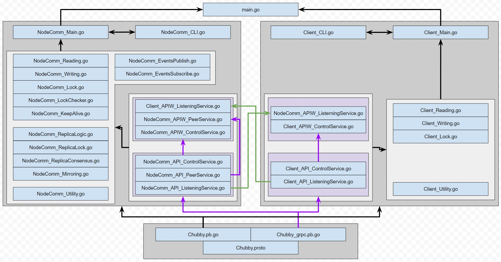

# Our Chubby Algorithm ^_^
This program is for the Distributed Systems and Computing Term 7 2022 group project.

## Authors
- Darryl Tan (1004152)
- Yu Hui Lau (1004410)
- Chua Jia Wei (1004369)
- Hannah Mah (1004332)

## Code Structure
Our general code structure is illustrated in the below diagram.



## General Usage
When first ran, our program starts an initial CLI interface that can be used to create, load, modify, and save start parameters. Upon "starting", you will be brought to either the CLI of the client or the CLI of a chubby replica.

Start the program by running either of the two commands while in the main directory:
```
go run .
```
or 
```
go run main.go
```

## Initial CLI
### Overview of Available Commands
```
Available Commands:
'help':                         Prints this help message or information about a given command.
'config':                       Used to set various parameters.
'guided-config':                Starts guided configuration.
'start':                        Starts the node.
'saveConfig':                   Saves the current configuration to file.
'listConfigs':                  Lists all known configurations.
'loadConfig':                   Loads a specified configuration from file.
'showConfig':                   Prints the current configuration.
'printConfig':                  An alias for 'showConfig'.
'startConfig':                  Loads and starts a specified configuration.
'updateDNS [IP] [PORT]':        Allows you to update the DNS table'.
'exit':                         Exits the program.
```

### help
This command prints out the list of avaialble commands.
```
> help <command>
```
Additionally, if the name of a command is provided as an argument, additional help text for the specified command will be provided if there is any.

### config
This command allows the parameters of the currently loaded configuration to be modified.
```
> config <param_name=param_value> <param_name=param_value> ...
```
Avaiable parameters are:
- nodeID: Any integer value in the range [0, inf)
- nodeIP: Any valid IPv4 address.
- nodePort: Any valid port number.
- verbose: 1 (off) and 2 (on).
- idOfMaster: Node ID of master server.
- configName: A name for this configuration. Whitespaces are not supported.
- nodeType: 's' or 'server' for Server and 'c' or 'client' for client.

Example Usage:
```
> config nodeID=11 nodeIP=127.0.0.1
```

### guided-config
This command launches a configuration wizard that walks the user through configuration.
```
> guided-config
```

### start
This command starts the current configuration. Assuming that the current configuration is valid, this command will also bring the user to either the CLI of the server or the CLI of the client, depending on the node type (nodeType) specified in the configuration.
```
> start
```

### saveConfig
This command will save the current configuration as a file.
```
> saveConfig <configuration_name>
```
Note: Whitespaces are not supported.

### listConfigs
This command will list all saved configurations.
```
> listConfigs
```

### loadConfig
This command will attempt to load the specified configuration from file.
```
> loadConfig <configuration_name>
```

### printConfig
This command prints the current configuration to the terminal.
```
> printConfig
```

### startConfig
This command is a convenience wrapper of loadConfig and start - it attempts to load then start the specified configuration.
```
> startConfig <configuration_name>
```

### updateDNS
This command enables one to manually add a new server's IP and port number to the DNS lookup table - Ensuring that the client will connect to at least one server
```
> updateDNS <ip_address> <port>
```

### exit
This command exits the program.
```
> exit
```

## Client CLI
### Overview of Available Commands
```
Available Commands:
'help':                                          Prints this menu.
'exit':                                          Exit program.
'write FILE_NAME' :                              Client sends Write Request to Master.
'read FILE_NAME':                                Client sends Read Request to Master.
'sub SUB_TYPE':                                  Sends a subscription request. Type help sub for more info.
'ls':                                            Lists the files available for the client
'll':                                            Lists the locks available for the client
'releaseLock FILE_NAME':                         Release lock for FILE_NAME
'requestLock LOCK_TYPE FILE_NAME':               Requests lock with LOCK_TYPE (read/write)for FILE_NAME
```

### help
This command prints out the list of avaliable commands.
```
> help <command>
```
Additionally, if the name of a command is provided as an argument, additional help text for the specified command will be provided if there is any.

### exit
This command exits the program.
```
> exit
```

### write FILE_NAME
This command sends a write request to the chubby primary. If the current client does not have a write lock yet, this command will also request a write lock first. Before sending the write file to the primary, this command will append the line *"This is a new line"* to the file requested. This is to allow users to know that the file has indeed been modified at the chubby master side upon a successful write. 
```
> write FILE_NAME
```
For example, if you wish to write to the file "file1.txt", please type
```
> write file1.txt
```

### read FILE_NAME
This command sends a read request to the chubby primary if the client does not have a valid cache of the file. If the current client does not have a read or write lock yet, this command will also request a read lock first. Upon a successful read, the client will write the file to its cache under `\client_cache\client_cache_N` where N is the client ID. It will then print out the first line (until the first "\n") of the file that was read. If the client has a valid cache of the file, it will simply print out the first line from the cache. Once read lock expires, the client's cache for that file will be invalidated.  
```
> read FILE_NAME
```
For example, if you wish to write to the file "file1.txt", please type
```
> read file1.txt
```

### sub SUB_TYPE
The client may subscribe to 4 events triggered at the chubby master. The master will then publish a message to each subscribed client upon the trigger of an event. Do note that out of all the events, only File Modification has been integrated with the chubby Master's code as we did not see the eventual need for all of the others. However, the master will still receive the other 3 subscription events and users can manually [publish](#publish) the event through the chubby master's command line. 

1. File Modification
When another client writes to a specified file, all other subscribed clients will receive a notification and will invalidate their own cache of the file. 
To subscribe to this event, type:
```
> sub FileMod FILE_NAME
```
where FILE_NAME is the name of the file to monitor such as "file1.txt"

2. Lock Acquire
This publishing of this event can only be tested by manually [publishing](#publish) it at the chubby master. 
To subscribe to this event, type:
```
> sub LockAcquire LOCK_NAME
```
where LOCK_NAME is the name of the lock to monitor such as "file1.txt.lock"

3. Lock Conflict
This publishing of this event can only be tested by manually [publishing](#publish) it at the chubby master. 
To subscribe to this event, type:
```
> sub LockConflict LOCK_NAME
```
where LOCK_NAME is the name of the lock to monitor such as "file1.txt.lock"

4. Master Failover
This publishing of this event can only be tested by manually [publishing](#publish) it at the chubby master. 
To subscribe to this event, type:
```
> sub MasterFailover
```
While this event may seem useful, our clients do not need to be notified of a handover. They can automatically find the new master when necessary. 

### ls
Allows you to retrieve the names of the files that are avaliable from the Chubby server side, similar to the ls function in the standard CLI
```
> ls
```

### ll
Prints out a list of locks that the client has currently acquired
```
> ll
```

### releaseLock
Allows client to manually release a lock of type (read/write) that is currently in its possession for a file 
```
> releaseLock <lock_type> <file_name>
```

### requestLock
Allows client to request for a lock of type (read/write) for a file 
```
> requestLock <lock_type> <file_name>
```

## Server CLI
### Overview of Available Commands
```
Available Commands:
'exit':                         Exit program.
'online':                       Onlines the node.
'offline':                      Offlines the node.
'config':                       Configuring node parameters.
'addPeer':                      Adds a record about a peer node.
'delPeer':                      Deletes a peer node record.
'getPeer':                      Get the list of peer records.
'msg':                          Send a plain text message to a peer node.
'getStatus':                    Obtain information about the node.
'startElection':                Used to manually trigger an election.
'publish':                      Used to manually publish an update to subscribed clients.
'wakeUpNode [ADDR:PORT]':       Used to manually wake up another replica.
'help':                         Prints this menu.
```

### exit
This command terminates the server and returns the user to the initial CLI.
```
> exit
```
Note: This command may not entirely terminate the server for quite a whie. To properly simulate a failed replica, we recommend terminating the entire program.

### online
This command 'onlines' the server replica. In this state, the replica will respond to messages.
```
> online
```

### offline
This command 'offlines' the server replica. In this state, the replica will ignore all messages except remote wake up messages from a coordinator.
```
> offline
```
Note: This command does not work correctly. To properly simulate a failed replica, we recommend terminating the entire program.

### config
This command modifies certain parameters of the server replica.
```
> config <param_name=param_value> <param_name=param_value> ...
```
Available parameters:
- id              =       ID_OF_THIS_NODE
- idOfMaster      =       ID_OF_MASTER
- verbose         =       1 or 2 for off and on respectively

### addPeer
This command addes a peer record to the server replica.
```
> addPeer NODE_ID:NODE_IP:NODE_PORT
```
Example:
```
> addPeer 2:127.0.0.1:9091
```

### delPeer
This command deletes the specified peer record from the server replica.
```
> delPeer NODE_ID
```

### getPeers
This command prints all peer records known to the server replica.
```
> getPeers
```

### msg
This command sends a single text message to another replica.
```
> msg <TEXT...>
```

### getStatus
This command prints some information about the replica.
```
> getStatus
```

### startElection
This command instructs the replica to initate an election within the replica network.
```
> startElection
```

### publish
The clients may subscribe to 4 events triggered at the chubby master. The master will then publish a message to each subscribed client upon the trigger of an event. Do note that out of all the events, only File Modification has been integrated with the chubby Master's code as we did not see the eventual need for all of the others. These commands here are to manually publish an event, sending a simple message to the subscribed clients. 

1. File Modification
When another client writes to a specified file, all other subscribed clients will receive a notification and will invalidate their own cache of the file. 
To manually publish this event to subscribed clients, type:
```
> publish FileMod FILE_NAME
```
where FILE_NAME is the name of the file to monitor such as "file1.txt"

2. Lock Acquire
To manually publish this event to subscribed clients, type:
```
> publish LockAcquire LOCK_NAME
```
where LOCK_NAME is the name of the lock to monitor such as "file1.txt.lock"

3. Lock Conflict
To manually publish this event to subscribed clients, type:
```
> publish LockConflict LOCK_NAME
```
where LOCK_NAME is the name of the lock to monitor such as "file1.txt.lock"

4. Master Failover
To manually publish this event to subscribed clients, type:
```
> publish MasterFailover
```

### wakeUpNode
This command is used by the coordinator to remotely instruct an offline replica to online and join the coordinator's network.
```
> wakeUpNode NODE_IP:NODE_PORT
```
Note: The joining node will attempt to use its configured ID. If another node in the network already has the same ID however, its ID will be automatically changed.

### help
This command prints the help menu to the terminal.
```
> help
```

